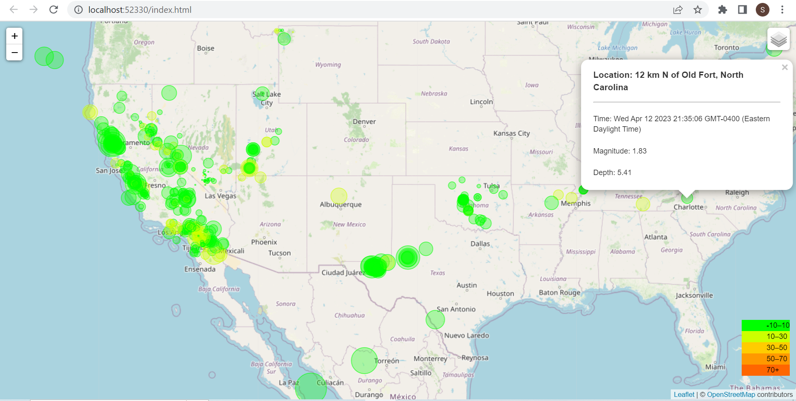

# Leaflet Challenge

This challenge is completed as requirement of Data Analytics Boot Camp at University of Toronto.

In this assignment, I have built an Earthquake Visualization based on data taken from the United States Geological Sruvey, or USGS for short. The USGS is responsible for providing scientific data about natural hazards, the health of our ecosystems and environment, and the impacts of climate and land-use change. Their scientists develop new methods and tools to supply timely, relevant, and useful information about the Earth and its processes.

The USGS is interested in building a new set of tools that will allow them to visualize their earthquake data. They collect a massive amount of data from all over the world each day, but they lack a meaningful way of displaying it. In this challenge, I was tasked with developing a way to visualize USGS data that will allow them to better educate the public and other government organizations (and hopefully secure more funding) on issues facing our planet.

## Craete the Earthquake Visualization

I have created the following visualization:

The USGS provides earthquake data in a number of different formats, updated every 5 minutes. It is available on the [USGS GeoJSON Feed](https://earthquake.usgs.gov/earthquakes/feed/v1.0/geojson.php).

Following steps are involved in creating this visualization:

1. Get the dataset:

    I have used the [USGS GeoJSON Feed](https://earthquake.usgs.gov/earthquakes/feed/v1.0/geojson.php) to get the past 7 days summary for all earthquakes in the GeoJSON format which is available at this [link](https://earthquake.usgs.gov/earthquakes/feed/v1.0/summary/all_week.geojson).

2. Import and visualize the data:

    I have used Leaflet to create a map that plots all the earthquakes from the dataset based on their longitude and latitude.

        The data markers reflect the magnitude of the earthquake by their size and the depth of the earthquake by color. Earthquakes with higher magnitudes appear larger, and earthquakes with greater depth appear darker in color.
        The depth of the earth can be found as the third coordinate for each earthquake.

        I have included popups that provide additional information about the earthquake when its associated marker is clicked such as location, time, magnitude and depth of the earthquake.

        I have created a legend that provides context for your map data based on depth of the earthquake.
